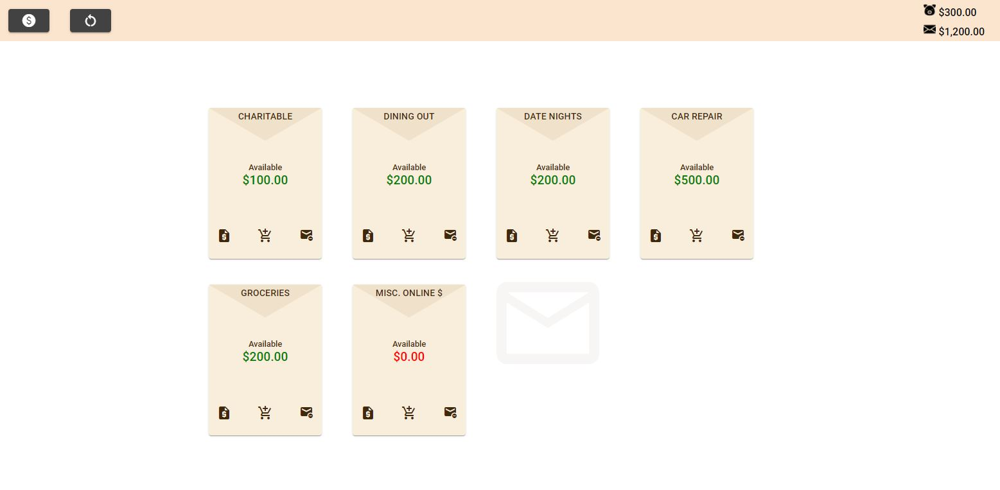

<!-- PROJECT LOGO -->
<br />
<p align="center">
  <a href="https://github.com/kevinmilly/PiggyLope-Budget">
    
  </a>

  <h3 align="center">PiggyLope Budget</h3>

  <p align="center">
    A Fun and Quick Way to budget using the 'Envelope System'
    <br />
    <a href="https://github.com/kevinmilly/PiggyLope-Budget"><strong>Explore the docs »</strong></a>
    <br />
    <br />
    <!-- <a href="readme-assets/">View Demo</a> -->
    ·
    <a href="https://github.com/kevinmilly/PiggyLope-Budget/issues">Report Bug</a>
    ·
    <a href="https://github.com/kevinmilly/PiggyLope-Budget/issues">Request Feature</a>
  </p>
</p>


<!-- TABLE OF CONTENTS -->
<details open="open">
  <summary>Table of Contents</summary>
  <ol>
    <li>
      <a href="#about-the-project">About The Project</a>
        <li><a href="#roadmap">Roadmap</a></li>
      <ul>
        <li><a href="#built-with">Built With</a></li>
      </ul>
    </li>
    <li>
      <a href="#getting-started">Getting Started</a>
      <ul>
        <li><a href="#end-user-setup">End User Setup</a></li>
        <li><a href="#developer-setup">Developer Setup</a></li>
      </ul>
    </li>
    <li><a href="#contributing">Contributing</a></li>
    <li><a href="#license">License</a></li>
    <li><a href="#contact">Contact</a></li>
    <li><a href="#acknowledgements">Acknowledgements</a></li>
  </ol>
</details>


<!-- ABOUT THE PROJECT -->
## About The Project

There are many envelope budgeting systems, digital and physical, that can help you get a handle on your finances.  The tactile nature of physical systems (using cash and actual labeled envelopes), really lends itself to increasing intentionality with spending money.  Literally taking money out of a 'savings'/envelope seems to help accountability.

However, personally, I identified some challenges:

* One challenge was the mobility of such a system; in many cases, it wasn't the most agile setup.
* Unless you kept a written balance on the envelope, you couldn't see how much you had left without opening the envelope.
* Was there a way to account for instances where I wasn't using cash?
* Was there a way to see performance metrics at a glance?

This project is an attempt to address these opportunities, to adapt the system for the above scenarios.



#### Creating Envelopes and reflecting purchases

By creating using an web app to mirror the envelope system, you can take advantage of the natural mobility of smartphones, tablets, or laptops.  You can create as many envelopes as you want, reflecting the amount of money you want to allocate towards each through an easy to use interface.  Whenever you want to make a purchase from an envelope/spending category, you can reflect the spending through an equally simple UI; decrementing the balance.  This accounting of the purchase in the app can happen before or after you make the actual purchase; the key is to reflect the spending in the app so you can track what you did.  Deliberately, putting it in the app mirrors the accountability offered from the traditional, physical setup. 

Once your balance reaches zero, you will no longer be able to spend from that category/envelope; until you replenish the envelope from your 'bank' balance or take from other envelopes.

The balance of each envelope is plainly shown on the front of the envelope card.  For an attractive visual indicator, the color of the balance changes as it lowers to zero.

#### Regular Budgeting

Day to day, week to week, month to month etc.  Whenever you are complete with your budgeting cycle, you can 'reset the envelopes' and your bank will begin at the set balance, and clearing the envelopes.  There is an existing issue for a feature that allows you the app to memorize the envelope balances of the previous cycle; however, currently a user will need to setup the balances for the envelopes again.  From cycle to cycle, as spending habits are discovered, it is likely there would be changes to envelope allocations anyways.  Nevertheless, it's clear that at least starting from a previous balance would be helpful. 


#### That's IT!

The point of the system is to be simple, but promote a small level of involvement by the spender.

<!-- ROADMAP -->
## Roadmap

*It would be great to further flesh out the 'Metrics' section, certaintly additonal information can be extracted from the data to benefit proactive budgeting. 

*General UX is an ongoing project.

See the [open issues](https://github.com/kevinmilly/PiggyLope-Budget/issues) for a list of proposed features (and known issues).


<!-- GETTING STARTED -->
## Getting Started

### End User Setup

1. Visit the app at, http://envelope-budget-55b22.web.app/
2. Sign in with Google
3. Get to work!

### Developer Setup

1. Clone the repo
   ```sh
   git clone https://github.com/kevinmilly/PiggyLope-BudgetQueue-D.git
   ```
2. Install NPM packages
   ```sh
   npm install
   ```

### Built With

* [Angular](https://ionicframework.com/docs/angular/your-first-app)
* [Firebase](https://firebase.google.com/)


<!-- CONTRIBUTING -->
## Contributing

Contributions are what make the open source community such an amazing place to be learn, inspire, and create. Any contributions you make are **greatly appreciated**.

Please feel free to contribute through code or through theory.  Everyone has their own thoughts in regards to how we can all become more productivity.  If you have thoughts in regards to ideas, please feel free to 'Create an Issue' or give feedback through a feature suggestion.


1. Fork the Project
2. Create your Feature Branch (`git checkout -b feature/AmazingFeature`)
3. Commit your Changes (`git commit -m 'Add some AmazingFeature'`)
4. Push to the Branch (`git push origin feature/AmazingFeature`)
5. Open a Pull Request


<!-- LICENSE -->
## License

Distributed under the MIT License. See `LICENSE` for more information.


<!-- CONTACT -->
## Contact

Kevin Smith - [Connect with me on LinkedIn](https://www.linkedin.com/in/ksmithtech/) - https://www.linkedin.com/in/ksmithtech/

Email me at: kevinmilly@gmail.com


